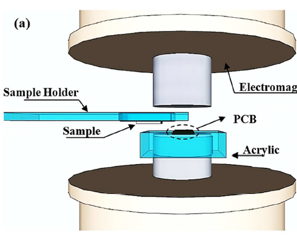
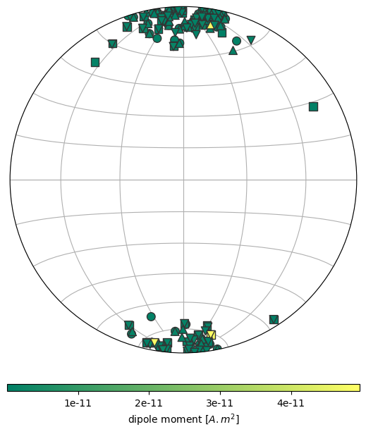
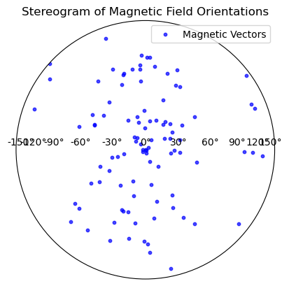
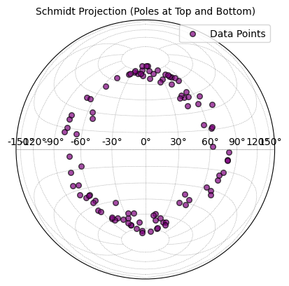

<!--
-------------------------------------------------------------------------------
This file defines the contents of each slide.
The reveal.js configuration can be found in index.html
-------------------------------------------------------------------------------
-->

<!-- .slide: class="slide-title" data-background-opacity="0.3" data-background-image="assets/magali-logo.svg" data-background-color="#000000" data-background-size="contain" -->

<!-- Place the content at the bottom of the slide -->

<h1 id="talk-title">
  
  Magali: Modelling and inversion of magnetic microscopy data 🧲🔬

</h1>

  <a id="talk-speaker">Yago M Castro</a>

<!-- Place location and date side-by-side with affiliation logos -->

<i class="fa fa-calendar-alt" style="margin: 0 10px 0 0"></i>
??????5 April 2024

Master's Degree Qualification Exam | IAG

<!-- Permission to reuse and CC-BY license logo -->
<i class="fa fa-camera" style="margin: 0 10px 0 0"></i>
Feel free to screenshot/share/reuse this presentation

<a href="https://creativecommons.org/licenses/by/4.0/"><i class="fab fa-creative-commons"></i><i class="fab fa-creative-commons-by" style="margin: 0 10px 0 2px"></i>CC-BY 4.0 License</a>

<!-- Add logos here. Need these wrappers to align them to the bottom right -->

  
  <!-- 
   -->

===============================================================================

# What is Paleomagnetism?

- The study of Earth’s magnetic field as <b>recorded</b> in rocks and sediments over <b>geological time</b>.

===============================================================================
# How magnetic minerals are formed?
<ul>
  <li><b>Thermoremanent Magnetization (TRM): </b>igneous rocks record Earth’s magnetic field as they cool below the Curie point</li>
  <li><b>Depositional Remanent Magnetization (DRM):</b> magnetic particles in sediments align with Earth’s field during deposition in aquatic environments</li>
</ul>

===============================================================================

# Why is paleomagnetism important?

<ul>
<li class="fragment"><b>Geomagnetic reversals:</b> shows that Earth's magnetic field has flipped many times throughout its history</li>
<li class="fragment"><b>Continental drift and plate tectonics:</b> helped confirm the theory of continental drift and reconstruct past positions of the continents</li>
<li class="fragment"><b>Geological dating:</b> used as a relative dating tool by comparing rock records with the known magnetic reversal timescale (magnetostratigraphy)</li>
<li class="fragment"><b>Paleofield reconstruction:</b> allows us to understand how Earth’s magnetic field has evolved over hundreds of millions of years</li>
</ul>

===============================================================================

===============================================================================

  

===============================================================================

  

Souza-Junior (2024)

===============================================================================

  

[Glenn et a. (2017)](https://doi.org/10.1002/2017gc006946)

===============================================================================

<!-- .slide: class="slide-title" data-background-opacity="1" data-background-image="assets/microscope-data.svg"  data-background-size="contain" -->

[Araujo et al. (2019)](https://doi.org/10.3390/s19071636)

===============================================================================

# Needs

- Algorithms for **automatic detection** of magnetic **grains** and its **magnetic moment** determination

- **Open software** for forward **modelling** and **inversion** techniques specific to magnetic microscopy 

- **Data conventions**  

===============================================================================

<!-- .slide: data-background-opacity="1" data-background-image="assets/readme-banner.png"  data-background-size="contain" data-background-color="#262626" -->

===============================================================================

<!-- .slide: data-background-opacity="0.2" data-background-image="assets/magali-logo.png"  data-background-size="contain" data-background-color="#262626" -->

What is Magali?

Free and open source 
 
<i class="fab fa-github"></i> <i class="fas fa-lock-open"></i>  <i class="fab fa-osi"></i>

Python library <i class="fab fa-python"></i>

Modelling and processing magnetic microscopy data 
 
<i class="fas fa-magnet"></i> <i class="fas fa-microscope"></i>

===============================================================================

<!-- .slide: data-background-opacity="0.2" data-background-image="assets/magali-logo.png"  data-background-size="contain" data-background-color="#262626" -->

# Why do we want to make it?

- Provide code that is **easy to use**

- Determine the **spatial positions** of **multiple** grains

- Facilitate the creation of **synthetic data**

- Propose a standard **data format**

- Serve as a **foundation** for new methods 

- Leverage the potential of emerging **magnetic microscopy** studies

===============================================================================

# How?

===============================================================================

# Needs

- Algorithms for **automatic detection** of magnetic **grains** and its **magnetic moment** determination

===============================================================================

<!-- .slide: data-background-opacity="1" data-background-image="assets/souza-jr-1.png"  data-background-size="contain" data-background-color="#262626" -->

===============================================================================

## Step 1: Automatic Source Detection and Separation
- **Goal:** isolate each magnetic particle in the image  
- **Methods used:**
<ul>
<li class='fragment'> <b>Total Gradient Amplitude (TGA):</b>  
  Enhances signal near the source (high-pass filter)</li>  
<li class='fragment'> <b>Contrast stretching:</b>  
  Uses percentiles (1st and 99th) to enhance weak particles</li>  
<li class='fragment'> <b>LoG (Laplacian of Gaussian) segmentation:</b>
  Detects “blobs” → 1 window = 1 particle </li> 
<li class='fragment'> Windows at borders are discarded</li>
</ul>

===============================================================================

# What is TGA?

Given a magnetic field $f(x, y, z)$:
$$
\left\| \vec{\nabla} f(x, y, z) \right\| = \sqrt{ \left( \partial_x f \right)^2 + \left( \partial_y f \right)^2 + \left( \partial_z f \right)^2 },
$$

===============================================================================

# Computing the Derivatives
<ul>
  <li>Use <strong>second-order central finite differences</strong> for spatial derivatives:</li>
</ul>
$$\Delta_xf(x, y, z) ≈ \frac{f(x + \Delta_{x,y,z}) - f(x - \Delta_{x,y,z})}{2\Delta_{x}}$$
<ul>
  <li>For ∂z: apply <strong>upward and downward continuation</strong> in the wavenumber domain.</li>
</ul>

===============================================================================

# Advantages of TGA
<ul>
  <li class="text-left fragment">Always positive</li>
  <li class="text-left fragment">Peaks directly over magnetic sources</li>
  <li class="text-left fragment">Less sensitive to magnetization direction</li>
  <li class="text-left fragment">Enhances local features, suppresses regional background</li>
  <li class="text-left fragment">Acts as a <b>high-pass filter</b>, removing long-wavelength noise.</li>
</ul>

===============================================================================

# Step 2: Position Estimation

- **Goal:** Estimate 3D location of magnetic particles.
- **Method:** Euler Deconvolution (ED)
<ul>
  <li class="fragment">Assumes dipolar source model</li>
  <li class="fragment">Applied to each segmented data region</li>
  <li class="fragment">Yields source position estimate</li>
</ul>

===============================================================================

 <h1>What is Euler Deconvolution?</h1>

- A method to estimate the location and depth of magnetic sources from total field data.

===============================================================================

<h1>The Idea Behind It</h1>
<ul>
  <li class="fragment">Uses spatial gradients of the magnetic field</li>
  <li class="fragment">Assumes simple source geometry</li>
  <li class="fragment">Based on Euler’s homogeneity equation</li>
</ul>

===============================================================================
# Euler's Homogeneity Equation
  
$$
(x - x_c)\partial_x f + (y - y_c)\partial_y f + (z - z_c)\partial_z f = (b - f)\eta
$$ 

- $x_c,y_c,z_c$ : coordinates of the magnetic field source
- $f$ : any function (Ex.: bz)
- $b$ : base level (constant shift in the signal)
- $\eta$ : structural index

[Souza-Junior et al 2024](https://agupubs.onlinelibrary.wiley.com/doi/10.1029/2023GC011082)

===============================================================================

### Structural index for magnetic (M) and gravity (G) sources of different source geometries.

| Source                     | Smellie model     | SI (M) | SI (G) |
|----------------------------|-------------------|--------|--------|
| Sphere                 | Dipole            | 3      | 2      |
| Vertical line end (pipe)  | Pole              | 2      | 1      |
| Horizontal line (cylinder) | Line of dipoles  | 2      | 0      |
| Thin bed fault         | Line of dipoles   | 2      | 2      |
| Thin sheet edge            | Line of poles     | 1      | 0      |
| Finite contact/fault   | —                 | 0  | −1     |
| Infinite contact/fault     | —                 | 0      | ∞  |

[Reid & Thurston (2014)](https://library.seg.org/doi/10.1190/geo2013-0235.1)

===============================================================================

# Euler's Homogeneity Equation
  
$$
(x - x_c)\partial_x f + (y - y_c)\partial_y f + (z - z_c)\partial_z f = (b - f)\eta
$$ 

 Rearranging into a pseudo‐parametric model with parameters $x_c, y_c, z_c,
b$

$$
x_c \ \partial_x f + y_c \\partial_y f + z_c \ \partial_z f + \eta b = x \ \partial_x f + y \ \partial_y f + z \ \partial_z f + \eta f
$$

[Souza-Junior et al 2024](https://agupubs.onlinelibrary.wiley.com/doi/10.1029/2023GC011082)

===============================================================================

# Euler's Homogeneity Equation
$$
x_c \ \partial_x f + y_c \\partial_y f + z_c \ \partial_z f + \eta b = x \ \partial_x f + y \ \partial_y f + z \ \partial_z f + \eta f
$$

 Applying to each data point, a $N \times 4$ linear system of equations can be formed

  \[
  \underbrace{
  \begin{bmatrix}
  \partial_x f_1 & \partial_y f_1 & \partial_z f_1 & \eta \\
  \partial_x f_2 & \partial_y f_2 & \partial_z f_2 & \eta \\
  \vdots & \vdots & \vdots & \vdots \\
  \partial_x f_N & \partial_y f_N & \partial_z f_N & \eta
  \end{bmatrix}
  }_{\text{Jacobian matrix}}
  \underbrace{
  \begin{bmatrix}
  x_c \\ y_c \\ z_c \\ b
  \end{bmatrix}
  }_{\text{Model parameters}}
  =
  \underbrace{
  \begin{bmatrix}
  x_1 \partial_x f_1 + y_1 \partial_y f_1 + z_1 \partial_z f_1 + \eta f_1 \\
  x_2 \partial_x f_2 + y_2 \partial_y f_2 + z_2 \partial_z f_2 + \eta f_2 \\
  \vdots \\
  x_N \partial_x f_N + y_N \partial_y f_N + z_N \partial_z f_N + \eta f_N
  \end{bmatrix}
  }_{\text{Data vector}}
  \]

$$\bold{Gp=h}$$

[Souza-Junior et al 2024](https://agupubs.onlinelibrary.wiley.com/doi/10.1029/2023GC011082)

===============================================================================
<!-- .slide: class="slide-transition" -->

# Assuming that errors in the spatial derivatives of $f$ are negligible

===============================================================================

#  Leats-squares solution

We want to solve:

$$
\mathbf{G} \mathbf{p} = \mathbf{h}
$$

When the system is <b>overdetermined</b> (more equations than unknowns), we seek a <b>least-squares solution</b>:

$$
\min \Phi (\mathbf{p}) =||\mathbf{h^o} - \mathbf{h}\||^2
$$

<ul>
  <li>$\Phi (\mathbf{p})$ : objective function</li>
  <li>$\mathbf{h^o}$ : observed data</li>
</ul>

===============================================================================

## Residual Vector

Define the <b>residual</b>:

$$
\mathbf{r} = \mathbf{h^o} - \mathbf{h}
$$

Objective function to be minimized:

$$
\Phi(\mathbf{p}) = \|\mathbf{r}\|^2
$$

===============================================================================

# To solve it
<ol>
  <li>
    <strong>Expand the expression:</strong> 
    \[
    \Phi(\mathbf{p}) = (\mathbf{h}^o - \mathbf{G}\mathbf{p})^\top (\mathbf{h}^o - \mathbf{G}\mathbf{p}) = \mathbf{h}^{o\top}\mathbf{h}^o - 2\mathbf{p}^\top \mathbf{G}^\top \mathbf{h}^o + \mathbf{p}^\top \mathbf{G}^\top \mathbf{G} \mathbf{p}
    \]
  </li>
  <li>
    <strong>Take the gradient with respect to \(\mathbf{p}\) and set to zero:</strong> 
    \[
      \nabla_{\mathbf{p}} \Phi(\mathbf{p}) = -2 \mathbf{G}^\top \mathbf{h}^o + 2 \mathbf{G}^\top \mathbf{G} \mathbf{p}=\mathbf{0}
    \]
    \[
      \boxed{
      \mathbf{G}^\top \mathbf{G} \mathbf{p} = \mathbf{G}^\top \mathbf{h}^o
      }
    \]
  </li>
  <li>
    <strong>Solve the normal equations:</strong> 
    \[
      \boxed{
      \mathbf{p} = (\mathbf{G}^\top \mathbf{G})^{-1} \mathbf{G}^\top \mathbf{h}^o
      }
    \]
  </li>
</ol>

===============================================================================

<!-- .slide: data-background-opacity="1" data-background-image="assets/issue-1.png"  data-background-size="contain" data-background-color="#262626" -->

===============================================================================

<!-- .slide: data-background-opacity="1" data-background-image="assets/benchmark.png"  data-background-size="contain" data-background-color="#262626" -->

===============================================================================

<!-- .slide: data-background-opacity="1" data-background-image="assets/issue-figshare.png"  data-background-size="contain" data-background-color="#262626" -->

===============================================================================

<!-- .slide: data-background-opacity="1" data-background-image="assets/fatiando-data-1.png"  data-background-size="contain" data-background-color="#262626" -->

===============================================================================

<!-- .slide: data-background-opacity="1" data-background-image="assets/export.png"  data-background-size="contain" data-background-color="#262626" -->

===============================================================================

<!-- .slide: data-background-opacity="1" data-background-image="assets/issue-stereogram.png"  data-background-size="contain" data-background-color="#262626" -->

===============================================================================

# Stereonet

===============================================================================

# Stereonet

===============================================================================

===============================================================================

<!-- .slide: data-background-opacity="0.2" data-background-image="assets/magali-logo.png"  data-background-size="contain" data-background-color="#262626" -->

<i class="fas fa-comments"></i>
 
Contact:
<a>yagomcastro1@gmail.com</a>

<i class="fab fa-github"></i>
 
Source code for this presentation:
 
[github.com/YagoMCastro/science-day-2024-magali](https://github.com/leouieda/talk-template)

<i class="fab fa-creative-commons"></i><i class="fab fa-creative-commons-by"></i>
 
Unless otherwise noted,
the contents of this presentation are
licensed under the
 
[Creative Commons Attribution 4.0 International License](https://creativecommons.org/licenses/by/4.0/).

