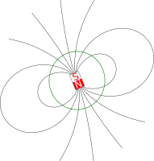
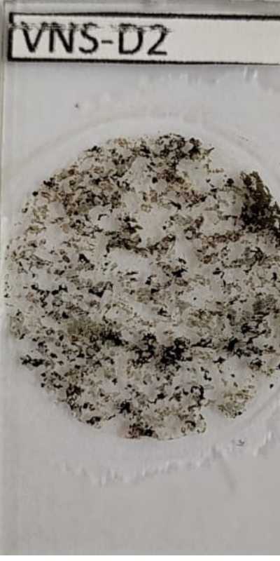
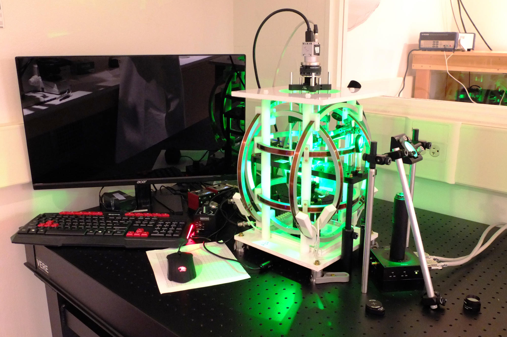
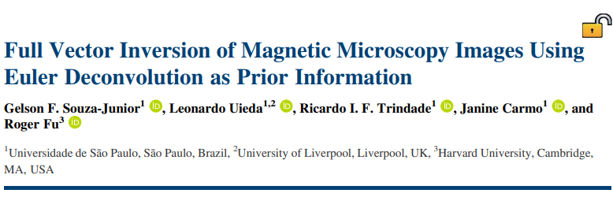
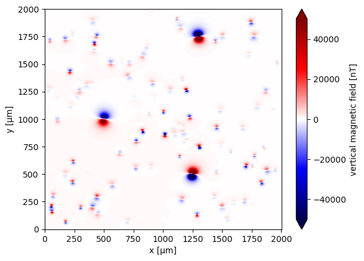
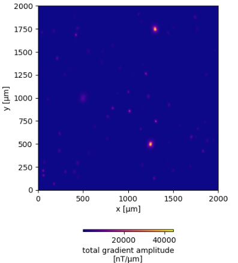
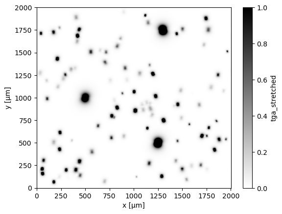

<!--
-------------------------------------------------------------------------------
This file defines the contents of each slide.
The reveal.js configuration can be found in index.html
-------------------------------------------------------------------------------
-->

<!-- .slide: class="slide-title" data-background-opacity="0.3" data-background-image="assets/magali-logo.svg" data-background-color="#000000" data-background-size="contain" -->

<!-- Place the content at the bottom of the slide -->
<div class="r-stretch">
</div>

<h1 id="talk-title">
  
  Magali: Modelling and inversion of magnetic microscopy data 🧲🔬

</h1>
<p id="talk-authors">
  <a id="talk-speaker">Yago M Castro</a>
</p>

<!-- Place location and date side-by-side with affiliation logos -->
<div class="row talk-info">
<div class="col-large">

<i class="fa fa-calendar-alt" style="margin: 0 10px 0 0"></i>
15 April 2022
<span style="margin: 0 20px"></span>
Master's Degree Seminar | IAG

<!-- Permission to reuse and CC-BY license logo -->
<i class="fa fa-camera" style="margin: 0 10px 0 0"></i>
Feel free to screenshot/share/reuse this presentation
<span style="margin: 0 20px"></span>
<a href="https://creativecommons.org/licenses/by/4.0/"><i class="fab fa-creative-commons"></i><i class="fab fa-creative-commons-by" style="margin: 0 10px 0 2px"></i>CC-BY 4.0 License</a>

</div>
<div class="col-medium">

<!-- Add logos here. Need these wrappers to align them to the bottom right -->
<div class="talk-logos-container">
<div class="talk-logos">
  <a href="https://www.compgeolab.org"></a>
  <!-- <a href="https://www.iag.usp.br/"></a>
  <a href="https://www.usp.br/"></a> -->
</div>
</div>

</div>
</div>

===============================================================================
# What is Paleomagnetism?
- The study of Earth’s magnetic field as <b>recorded</b> in rocks.

===============================================================================
# How minerals are magnetized?
<ul>
  <li class="fragment"><b>Thermoremanent Magnetization (TRM): </b>igneous rocks record Earth’s magnetic field as they cool below the Curie point</li>
  <li class="fragment"><b>Depositional Remanent Magnetization (DRM):</b> magnetic particles in sediments align with Earth’s field during deposition in aquatic environments</li>
</ul>

===============================================================================
# Why is paleomagnetism important?

<ul>
<li class="fragment"><b>Geomagnetic reversals:</b> shows that Earth's magnetic field has flipped many times throughout its history</li>
<li class="fragment"><b>Continental drift and plate tectonics:</b> helped confirm the theory of continental drift and reconstruct past positions of the continents</li>
<li class="fragment"><b>Geological dating:</b> used as a relative dating tool by comparing rock records with the known magnetic reversal timescale (magnetostratigraphy)</li>
<li class="fragment"><b>Paleofield reconstruction:</b> allows us to understand how Earth’s magnetic field has evolved over hundreds of millions of years</li>
</ul>

===============================================================================


===============================================================================
<div class="r-stretch">
  
</div>

===============================================================================
<div class="r-stretch">

  

</div>

<div class="footnote-center">

[Souza-Junior (2024)](https://agupubs.onlinelibrary.wiley.com/doi/10.1029/2023GC011082)

</div>

===============================================================================
<div class="r-stretch">

  

</div>
<br>
<div class="footnote-left">

[Harvard Paleomagnetics Lab](https://paleomag.fas.harvard.edu/laboratory)
</div>

===============================================================================
<!-- .slide: class="slide-title" data-background-opacity="1" data-background-image="assets/microscope-data.svg"  data-background-size="contain" -->

<div class="r-stretch">
</div>
<div class="footnote-left">

[Glenn et al. (2017)](https://doi.org/10.1002/2017gc006946)
</div>

===============================================================================
# Needs
<div class="fragment">

- Algorithms for **automatic detection** of magnetic **grains** and its **magnetic moment** determination

</div>
<div class="fragment">

- **Open software** for forward **modelling** and **inversion** techniques specific to magnetic microscopy 

</div>

<div class="fragment text-left">

- **Data conventions**  

</div>

===============================================================================
<!-- .slide: data-background-opacity="1" data-background-image="assets/readme-banner.png"  data-background-size="contain" data-background-color="#262626" -->

===============================================================================
<!-- .slide: data-background-opacity="0.2" data-background-image="assets/magali-logo.png"  data-background-size="contain" data-background-color="#262626" -->

<div class="huge ">

What is Magali?

<div class="large fragment">

Free and open source 
<br>
<i class="fab fa-github"></i> <i class="fas fa-lock-open"></i>  <i class="fab fa-osi"></i>

</div>

</div>
<div class="large fragment">

Python library <i class="fab fa-python"></i>

</div>

<div class="large fragment">

Modelling and processing magnetic microscopy data 
<br>
<i class="fas fa-magnet"></i> <i class="fas fa-microscope"></i>

</div>

===============================================================================
<!-- .slide: data-background-opacity="0.2" data-background-image="assets/magali-logo.png"  data-background-size="contain" data-background-color="#262626" -->
# Why do we want to make it?

<div class="fragment text-left">

- Provide code that is **easy to use**

</div>

<div class="fragment text-left">

- Determine the **spatial positions** of **multiple** grains

</div>
<div class="fragment text-left">

- Facilitate the creation of **synthetic data**

</div>
<div class="fragment text-left">

- Propose a standard **data format**

</div>

<div class="fragment text-left">

- Serve as a **foundation** for new methods 

</div>
<div class="fragment text-left">

- Leverage the potential of emerging **magnetic microscopy** studies

</div>

===============================================================================
# Needs

- Algorithms for **automatic detection** of magnetic **grains** and its **magnetic moment** determination

===============================================================================



===============================================================================
<!-- .slide: data-background-opacity="1" data-background-image="assets/synthetic.png"  data-background-size="contain" data-background-color="#262626" -->

===============================================================================
<p class="text-left"> <b>Step 1 - Source Detection</b></p>
<p class="text-left"> <b>Step 2 - Iterative processing (per window)</b></p>
<ul>
  <li>(a) <strong>Isolate data</strong> – Select magnetic data inside window</li>
  <li>(b) <strong>Euler deconvolution</strong> – Estimate source <em>position</em></li>
  <li>(c) <strong>Linear inversion</strong> – Estimate dipole <em>moment</em> using fixed position</li>
  <li>(d) <strong>Non-linear inversion</strong> – Refine position & moment via <a href="https://academic.oup.com/comjnl/article-abstract/7/4/308/354237?redirectedFrom=fulltext">Nelder-Mead</a></li>
  <li>(e) <strong>Signal removal</strong> – Forward model dipole & subtract from full dataset</li>
</ul>
<p class="text-left"> <b>Step 3 - Repeat detection on residual data:</b> Apply steps 1 and 2  to the stripped dataset to identify new sources and compute their parameters

===============================================================================
## Step 1: Source Detection
- **Goal:** isolate each magnetic particle in the image  
- **Methods used:**
<ul>
<li class='fragment'> Upward continuation</li> 
<li class='fragment'> <b>Total Gradient Amplitude (TGA):</b>  
  Enhances signal near the source (high-pass filter)</li>  
<li class='fragment'> <b>Contrast stretching:</b>  
  Uses percentiles (1st and 99th) to enhance weak particles</li>  
<li class='fragment'> <b>LoG (Laplacian of Gaussian) segmentation:</b>
  Detects “blobs” → 1 window = 1 particle </li>
<li class="fragment">Rank by decreasing signal strength</li>
</ul>

===============================================================================
# What is TGA?

Given a magnetic field $f(x, y, z)$:
$$
\left\| \vec{\nabla} f(x, y, z) \right\| = \sqrt{ \left( \partial_x f \right)^2 + \left( \partial_y f \right)^2 + \left( \partial_z f \right)^2 },
$$

===============================================================================
# Computing the Derivatives
<div class="text_left">
<ul>
  <li>Use <strong>second-order central finite differences</strong> for spatial derivatives:</li>
</ul>
</div>
$$\Delta_xf(x, y, z) ≈ \frac{f(x + \Delta x,y,z) - f(x - \Delta x,y,z)}{2\Delta_{x}}$$
<div class="text_left">
<ul>
  <li>For $\partial z$: apply <strong>upward</strong> and <b>downward</b> in the frequency domain</li>
</ul>
</div>

===============================================================================
# Advantages of TGA
<ul>
  <li class="text-left fragment">Always positive</li>
  <li class="text-left fragment">Peaks directly over magnetic sources</li>
  <li class="text-left fragment">Less sensitive to magnetization direction</li>
  <li class="text-left fragment">Enhances local features, suppresses regional background</li>
  <li class="text-left fragment">Acts as a <b>high-pass filter</b>, removing long-wavelength noise.</li>
</ul>

===============================================================================
<div class="row">
<div class="col"></div>
<div class="col"></div>
</div>

===============================================================================
# Contrast Stretching
- **Goal**: Rescale TGA values to highlight weak/strong signals.  
- **Operation**: Per-pixel transformation to normalize data: 

<p>
\[
\text{TGA}_{\text{rescaled}} = 2 \left( \frac{\text{TGA} - v_{\min}}{v_{\max} - v_{\min}} \right) - 1
\]

</p>

<ul>
<li>$ v_{\text{min}} = 1^\text{st} $ percentile  </li>
<li>$ v_{\text{max}} = 99^\text{th} $ percentile  </li>
<li><b>Output:</b> values stretched to range $[0, 1]$</li>
</ul>

===============================================================================
# Why Percentile Bounds?
- **Robust Scaling**:  
  - Ignores extreme outliers (e.g., sensor noise).  
- **Empirical Validation**:  
  - Works well for real magnetic microscopy datasets.  
- **Dynamic Range**: Ensures both weak and strong signals are visible.

===============================================================================
<div class="row">
<div class="col"></div>
<div class="col"></div>
</div>

===============================================================================
# LoG Blob Detection
<ul>
  <li class="fragment text-left"><b>Algorithm:</b> Laplacian of Gaussian (LoG)</li>
  <li class="fragment text-left"><b>Purpose:</b> Detect local maxima ("blobs") in rescaled TGA image</li>
  <li class="fragment text-left"><b>Advantages:</b></li>
  <ul>
    <li class="fragment text-left">Ideal for dark blobs on light backgrounds</li>
    <li class="fragment text-left">Accurately identifies particle locations/sizes</li>
  </ul>
  <li class="fragment text-left"><b>Computation:</b> Fast for typical magnetic microscopy image sizes</li>
</ul>

===============================================================================
# Implementation Notes
- **Border Handling**: exclude blobs near image edges to avoid truncation artifacts.  
- **One-Time Cost**: LoG runs once per image.  
- **Trade-off**: higher accuracy at the cost of longer runtime (acceptable for dataset sizes).  

===============================================================================
# Step 2: Iterative processing (per window)
<ul>
  <li>(a) <strong>Isolate data</strong> – Select magnetic data inside window</li>
  <li>(b) <strong>Euler deconvolution</strong> – Estimate source <em>position</em></li>
  <li>(c) <strong>Linear inversion</strong> – Estimate dipole <em>moment</em> using fixed position</li>
  <li>(d) <strong>Non-linear inversion</strong> – Refine position & moment via <a href="https://academic.oup.com/comjnl/article-abstract/7/4/308/354237?redirectedFrom=fulltext">Nelder-Mead</a></li>
  <li>(e) <strong>Signal removal</strong> – Forward model dipole & subtract from full dataset</li>
</ul>

===============================================================================
<!-- .slide: class="slide-transition" -->
# Euler Deconvolution

===============================================================================
# Euler Deconvolution
<p class="fragment text-left"><b>What it is:</b> a method to estimate the location and depth of magnetic sources from total field data</p>
<div class="text-left fragment">
  <b>Characteristics:</b><br>
  <ul class="text-left"> 
    <li class="fragment ">Assumes dipolar source model</li>
    <li class="fragment">Applied to each segmented data region</li>
    <li class="fragment">Yields source position estimate</li>
    <li class="fragment">Based on Euler’s homogeneity equation</li>
  </ul>
</div>

===============================================================================
# Euler's Homogeneity Equation
$$
(x - x_c)\partial_x f + (y - y_c)\partial_y f + (z - z_c)\partial_z f = (b - f)\eta
$$ 
<div class="text-left">
<ul>
  <li class="fragment">$x,y,z$ : data coordinates</li>
  <li class="fragment">$x_c,y_c,z_c$ : coordinates of the magnetic field source</li>
  <li class="fragment">$f$ : any homogenous function (Ex.: bz)</li>
  <li class="fragment">$b$ : base level (constant shift in the signal)</li>
  <li class="fragment">$\eta$ : structural index</li>
</ul>
</div>
<div class="footnote-center">

[Souza-Junior et al 2024](https://agupubs.onlinelibrary.wiley.com/doi/10.1029/2023GC011082)
</div>

===============================================================================
# Euler's Homogeneity Equation
$$
(x - x_c)\partial_x f + (y - y_c)\partial_y f + (z - z_c)\partial_z f = (b - f)\eta
$$ 
<p class="fragment"> Expanding into a pseudo‐parametric model with parameters $x_c, y_c, z_c,
b$</p>
<div class="fragment">

$$
\underbrace{x_c \partial_x f + y_c \partial_y f + z_c \partial_z f + \eta b}_\text{Paremetric} = \underbrace{x \partial_x f + y \partial_y f + z \partial_z f + \eta f}_\text{Nonparametric}
$$
</div>
<div class="footnote-center">

[Souza-Junior et al 2024](https://agupubs.onlinelibrary.wiley.com/doi/10.1029/2023GC011082)
</div>

===============================================================================
# Euler's Homogeneity Equation
$$
x_c \ \partial_x f + y_c \\partial_y f + z_c \ \partial_z f + \eta b = x \ \partial_x f + y \ \partial_y f + z \ \partial_z f + \eta f
$$

<p class="fragment"> Applying to each data point, a $N \times 4$ linear system of equations can be formed</p>
<p class="fragment">
  \[
  \underbrace{
  \begin{bmatrix}
  \partial_x f_1 & \partial_y f_1 & \partial_z f_1 & \eta \\
  \partial_x f_2 & \partial_y f_2 & \partial_z f_2 & \eta \\
  \vdots & \vdots & \vdots & \vdots \\
  \partial_x f_N & \partial_y f_N & \partial_z f_N & \eta
  \end{bmatrix}
  }_{\text{Jacobian matrix}}
  \underbrace{
  \begin{bmatrix}
  x_c \\ y_c \\ z_c \\ b
  \end{bmatrix}
  }_{\text{Paremeter vector}}
  =
  \underbrace{
  \begin{bmatrix}
  x_1 \partial_x f_1 + y_1 \partial_y f_1 + z_1 \partial_z f_1 + \eta f_1 \\
  x_2 \partial_x f_2 + y_2 \partial_y f_2 + z_2 \partial_z f_2 + \eta f_2 \\
  \vdots \\
  x_N \partial_x f_N + y_N \partial_y f_N + z_N \partial_z f_N + \eta f_N
  \end{bmatrix}
  }_{\text{Pseudo-data vector}}
  \]
</p>

<div class="fragment">

$$\bold{Gp=h}$$

</div>
<div class="footnote-center">

[Souza-Junior et al 2024](https://agupubs.onlinelibrary.wiley.com/doi/10.1029/2023GC011082)
</div>

===============================================================================
#  Least-squares solution
$$
\mathbf{G} \mathbf{p} = \mathbf{h}
$$

<div  class= " text-left fragment">
<p class="text-left">We use a <b>least-squares solution</b>, with the objective function being:</p>

$$
\Phi (\mathbf{p}) =||\mathbf{h^o} - \mathbf{h}\||^2
$$

<ul>
  <li>$\Phi (\mathbf{p})$ : objective function</li>
  <li>$\mathbf{h^o}$ : observed data</li>
  <li>$\mathbf{h}$ : predicted data</li></ul>
</div>

===============================================================================
# To solve it
<ol>
  <li class="fragment">
    <strong>Expand the expression:</strong><br>
    \[
    \Phi(\mathbf{p}) = (\mathbf{h}^o - \mathbf{G}\mathbf{p})^\top (\mathbf{h}^o - \mathbf{G}\mathbf{p}) = \underbrace{\mathbf{h}^{o\top}\mathbf{h}^o - 2\mathbf{p}^\top \mathbf{G}^\top \mathbf{h}^o + \mathbf{p}^\top \mathbf{G}^\top \mathbf{G} \mathbf{p}}_\text{Paraboloid}
    \]
  </li>
  <li class="fragment">
    <strong>Take the gradient with respect to \(\mathbf{p}\) and set to zero:</strong><br>
    \[
      \nabla_{\mathbf{p}} \Phi(\mathbf{p}) = -2 \mathbf{G}^\top \mathbf{h}^o + 2 \mathbf{G}^\top \mathbf{G} \mathbf{p}=\mathbf{0}
    \]
    \[
      \boxed{
      \mathbf{G}^\top \mathbf{G} \mathbf{p} = \mathbf{G}^\top \mathbf{h}^o
      }
    \]
  </li>
  <li class="fragment">
    <strong>Solve the normal equations and estimate $x_c$, $y_c$, $z_c$ and $b$:</strong><br>
  </li>
</ol>

===============================================================================
<!-- .slide: class="slide-transition" -->
# Linear inversion

===============================================================================
<h1>Dipole Field Model</h1>
<p class="text-left">The field $\mathbf{b}$ generated by a dipole $\mathbf{m} = [m_x \ m_y \ m_z]^\top$:</p>
$$
\mathbf{b} = 
\begin{bmatrix}
b_x \\
b_y \\
b_z
\end{bmatrix}
=
\frac{\mu_0}{4\pi}
\begin{bmatrix}
\frac{\partial^2}{\partial x \partial x} \frac{1}{r} & \frac{\partial^2}{\partial x \partial y} \frac{1}{r} & \frac{\partial^2}{\partial x \partial z} \frac{1}{r} \\
\frac{\partial^2}{\partial y \partial x} \frac{1}{r} & \frac{\partial^2}{\partial y \partial y} \frac{1}{r} & \frac{\partial^2}{\partial y \partial z} \frac{1}{r} \\
\frac{\partial^2}{\partial z \partial x} \frac{1}{r} & \frac{\partial^2}{\partial z \partial y} \frac{1}{r} & \frac{\partial^2}{\partial z \partial z} \frac{1}{r}
\end{bmatrix}
\begin{bmatrix}
m_x \\
m_y \\
m_z
\end{bmatrix}
=
\frac{\mu_0}{4\pi} \mathbf{M} \mathbf{m}
$$
<br>
<div class="text-left"><ul>
<li> $r=\sqrt{(x-x_c)^2+(y-y_c)^2+(z-z_c)^2}$ </li>
<li> $\mu_0$ : magnetic permeability</li>
</ul></div>

===============================================================================
<h1>System for $b_z$</h1>
<p>
\[
\mathbf{b} = 
\begin{bmatrix}
b_x \\
b_y \\
b_z
\end{bmatrix}
=
\frac{\mu_0}{4\pi}
\begin{bmatrix}
\frac{\partial^2}{\partial x \partial x} \frac{1}{r} & \frac{\partial^2}{\partial x \partial y} \frac{1}{r} & \frac{\partial^2}{\partial x \partial z} \frac{1}{r} \\
\frac{\partial^2}{\partial y \partial x} \frac{1}{r} & \frac{\partial^2}{\partial y \partial y} \frac{1}{r} & \frac{\partial^2}{\partial y \partial z} \frac{1}{r} \\
\frac{\partial^2}{\partial z \partial x} \frac{1}{r} & \frac{\partial^2}{\partial z \partial y} \frac{1}{r} & \frac{\partial^2}{\partial z \partial z} \frac{1}{r}
\end{bmatrix}
\begin{bmatrix}
m_x \\
m_y \\
m_z
\end{bmatrix}
=
\frac{\mu_0}{4\pi} \mathbf{M} \mathbf{m}
\]</p>

$$
b_z = 
\frac{\mu_0}{4\pi}
\begin{bmatrix}
\frac{\partial^2}{\partial z \partial x} \frac{1}{r} & \frac{\partial^2}{\partial z \partial y} \frac{1}{r} & \frac{\partial^2}{\partial z \partial z} \frac{1}{r}
\end{bmatrix}
\begin{bmatrix}
m_x \\
m_y \\
m_z
\end{bmatrix}^\top 
$$


===============================================================================
$$
\frac{\partial^2}{\partial z \partial x} \frac{1}{r} = \frac{3(z - z_c)(x - x_c)}{r^5}
$$
$$
\frac{\partial^2}{\partial z \partial y} \frac{1}{r} = \frac{3(z - z_c)(y - y_c)}{r^5}
$$
$$
\frac{\partial^2}{\partial z \partial z} \frac{1}{r} = \frac{3(z - z_c)^2}{r^5} - \frac{1}{r^3}
$$

===============================================================================
<h1>Problem Formulation</h1>
<p class="text-left">Given $N$ observations of $b_{z}$ in a window containing a single source an $N\times 3$ linear system is formed:</p>
\[
\underbrace{  
\begin{bmatrix}
\frac{\mu_0}{4\pi} \frac{3(z_1 - z_c)(x_1 - x_c)}{r_1^5} & \frac{\mu_0}{4\pi} \frac{3(z_1 - z_c)(y_1 - y_c)}{r_1^5} & \frac{\mu_0}{4\pi} \left( \frac{3(z_1 - z_c)^2}{r_1^5} - \frac{1}{r_1^3} \right) \\
\frac{\mu_0}{4\pi} \frac{3(z_2 - z_c)(x_2 - x_c)}{r_2^5} & \frac{\mu_0}{4\pi} \frac{3(z_2 - z_c)(y_2 - y_c)}{r_2^5} & \frac{\mu_0}{4\pi} \left( \frac{3(z_2 - z_c)^2}{r_2^5} - \frac{1}{r_2^3} \right) \\
\vdots & \vdots & \vdots \\
\frac{\mu_0}{4\pi} \frac{3(z_N - z_c)(x_N - x_c)}{r_N^5} & \frac{\mu_0}{4\pi} \frac{3(z_N - z_c)(y_N - y_c)}{r_N^5} & \frac{\mu_0}{4\pi} \left( \frac{3(z_N - z_c)^2}{r_N^5} - \frac{1}{r_N^3} \right)
\end{bmatrix}}_{\text{Jacobian matrix}}
\underbrace{
\begin{bmatrix}
m_x \\
m_y \\
m_z
\end{bmatrix}}_{\text{Parameter vector}}
=
\underbrace{
\begin{bmatrix}
b_{z_1} \\
b_{z_2} \\
\vdots \\
b_{z_N}
\end{bmatrix}}_{\text{Observation vector}}
\]
<p class="fragment">$$\mathbf{Am=d}$$</p>

===============================================================================
<h1>Least Squares Estimation</h1>
<p class="text-left">We minimize the misfit function:</p>
$$\Gamma(\mathbf{m}) = \|\mathbf{d}^{o}-\mathbf{A}\mathbf{m}\|^2=(\mathbf{d}^{o}-\mathbf{A}\mathbf{m})^T(\mathbf{d}^{o}-\mathbf{A}\mathbf{m})$$
<p class="text-left">Leading to the normal equations:</p>
$$\mathbf{A}^T\mathbf{A}\mathbf{m} = \mathbf{A}^T\mathbf{d}^{o}$$
<p class="fragment">Solution gives estimated dipole moment $\mathbf{m}$</p>

===============================================================================
<!-- .slide: class="slide-transition" -->
# Non-Linear inversion

===============================================================================
<h1>Problem with Linear Inversion</h1>
<p class="fragment text-left">We now have estimatives for position and magnetic moment of the sources</p>
<p class="fragment text-left">However <strong>interfering sources</strong> distort these estimates</p>
<h2 class="fragment"><strong>Solution:</strong> non-linear optimization</h2>

===============================================================================
<h1>Non-Linear Misfit Function</h1>
<div class="math-block">
    \[
    \xi(\mathbf{x}, \mathbf{m}) = \| (\mathbf{d}^o - b) - \mathbf{d}(\mathbf{x}, \mathbf{m}) \|_2^2
    \]
</div>
<p >Optimizes position \(\mathbf{x}\) and dipole moment \(\mathbf{m}\)</p>
<ul>
    <li>\(\mathbf{d}^o \): observed data</li>
    <li>b: background field</li>
    <li>\(\mathbf{d}(\mathbf{x}, \mathbf{m})\): forward model prediction</li>
</ul>

===============================================================================
<h2>Why Nelder-Mead?</h2>
<ul>
    <li class="fragment">No need for gradient calculations</li>
    <li class="fragment">Simple to implement</li>
    <li class="fragment">Effective for low-dimensional problems (like our 6-parameter dipole problem)</li>
</ul>

===============================================================================
<!-- .slide: class="slide-transition" -->
# Signal Removal

===============================================================================

<h2>Why Not Full-Scale Inversion?</h2>
<h3>Key Computational Challenges</h3>
<ul>
    <li class="fragment">
        <strong>Background Field:</strong>
        Requires pre-processing → Risk of bias
    </li>
    <li class="fragment">
        <strong>Benchmark Results:</strong>
        <span class="pros">Windowed data</span> outperforms in speed/accuracy
    </li>
</ul>


===============================================================================
<h2>Sequential Subtraction Method</h2>
<div class="fragment">
  <p>Workflow</p>
  <ol>
    <li class="fragment">Model strongest source (dipole equation)</li>
    <li class="fragment">Subtract signal from dataset</li>
    <li class="fragment">Recalculate for next source (strong → weak)</li>
  </ol>
</div>

===============================================================================
<p class="text-left"> <b>Step 1 - Source Detection</b></p>
<p class="text-left"> <b>Step 2 - Iterative processing (per window)</b></p>
<ul>
  <li>(a) <strong>Isolate data</strong> – Select magnetic data inside window</li>
  <li>(b) <strong>Euler deconvolution</strong> – Estimate source <em>position</em></li>
  <li>(c) <strong>Linear inversion</strong> – Estimate dipole <em>moment</em> using fixed position</li>
  <li>(d) <strong>Non-linear inversion</strong> – Refine position & moment via <a href="https://academic.oup.com/comjnl/article-abstract/7/4/308/354237?redirectedFrom=fulltext">Nelder-Mead</a></li>
  <li>(e) <strong>Signal removal</strong> – Forward model dipole & subtract from full dataset</li>
</ul>
<p class="text-left fragment"> <b>Step 3 - Repeat detection on residual data:</b> Apply steps 1 and 2  to the stripped dataset to identify new sources and compute their parameters

===============================================================================
<!-- .slide: data-background-opacity="1" data-background-image="assets/re-detection-methodology.png"  data-background-size="contain" data-background-color="#262626" -->

===============================================================================

<!-- .slide: data-background-opacity="1" data-background-image="assets/readme-banner.png"  data-background-size="contain" data-background-color="#262626" -->

===============================================================================
<!-- .slide: data-background-opacity="1" data-background-image="assets/github.png"  data-background-size="contain" data-background-color="#262626" -->

===============================================================================
<!-- .slide: data-background-opacity="1" data-background-image="assets/github_1.png"  data-background-size="contain" data-background-color="#262626" -->

===============================================================================
<!-- .slide: data-background-opacity="1" data-background-image="assets/github_readme.png"  data-background-size="contain" data-background-color="#262626" -->

===============================================================================
<!-- .slide: data-background-opacity="1" data-background-image="assets/pull_requests.png"  data-background-size="contain" data-background-color="#262626" -->

===============================================================================
<!-- .slide: data-background-opacity="1" data-background-image="assets/pull_request_details.png"  data-background-size="contain" data-background-color="#262626" -->

===============================================================================
<!-- .slide: data-background-opacity="1" data-background-image="assets/pull_request_details_1.png"  data-background-size="contain" data-background-color="#262626" -->

===============================================================================
<!-- .slide: data-background-opacity="1" data-background-image="assets/pull_request_details_2.png"  data-background-size="contain" data-background-color="#262626" -->

===============================================================================
<!-- .slide: data-background-opacity="1" data-background-image="assets/checks.png"  data-background-size="contain" data-background-color="#262626" -->

===============================================================================
```python
def test_dipole_bz_grid(souza_junior_model):
    # Use model fixture from _models.py
    data = souza_junior_model

    # Test units
    assert data.x.units == "µm"
    assert data.y.units == "µm"
    assert data.units == "nT"

    # Test array sizes
    assert data.x.size == 1001
    assert data.y.size == 1001
    assert data.size == 1002001

    # Test data name
    assert data.long_name == "vertical magnetic field"

    # Test if data is a DataArray
    assert isinstance(data.x, xr.DataArray)
    assert isinstance(data.y, xr.DataArray)
    assert isinstance(data, xr.DataArray)
```

===============================================================================
<!-- .slide: data-background-opacity="1" data-background-image="assets/documentation.png"  data-background-size="contain" data-background-color="#262626" -->

===============================================================================
<!-- .slide: data-background-opacity="1" data-background-image="assets/api.png"  data-background-size="contain" data-background-color="#262626" -->

===============================================================================
<!-- .slide: data-background-opacity="1" data-background-image="assets/doc_function.png"  data-background-size="contain" data-background-color="#262626" -->

===============================================================================
<!-- .slide: data-background-opacity="1" data-background-image="assets/fatiando-data.png"  data-background-size="contain" data-background-color="#262626" -->

===============================================================================
<!-- .slide: data-background-opacity="1" data-background-image="assets/morroco.png"  data-background-size="contain" data-background-color="#262626" -->

===============================================================================
<!-- .slide: class="slide-transition" -->
# Schedule

===============================================================================
  <h1>Done</h1>
<div class="text-left">
  <h3>WP1: Initial Software Prototype</h3>
  <ul>
    <li class="fragment"><strong>WP1.1:</strong> GitHub repo + package structure</li>
    <li class="fragment"><strong>WP1.2:</strong> Forward modeling of dipoles + synthetic data</li>
    <li class="fragment"><strong>WP1.3:</strong> QDM I/O routines + visualization</li>
    <li class="fragment"><strong>WP1.4:</strong> Source detection (Souza-Junior et al.)</li>
    <li class="fragment"><strong>WP1.6:</strong> Euler Deconvolution in <em>Harmonica</em></li>
  </ul>
</div>

===============================================================================
<h2>In Progress</h2>
<div class=" fragment text-left">

  <h3>WP1: Initial Software Prototype</h3>
  <ul>
    <li class="fragment"><strong>WP1.5:</strong> Release v0.1 (internal test)</li>
    <li class="fragment"><strong>WP1.7:</strong> Linear inversion for dipole moments</li>
    <li class="fragment"><strong>WP1.8:</strong> Release v0.2 with inversion</li>
  </ul>

  <div class="fragment">
    <h3>WP2: Non-linear inversion methods</h3>
    <ul>
      <li><strong>WP2.1:</strong> Study inverse theory background</li>
    </ul>
  </div>
</div>

===============================================================================
<h2>To Do</h2>
<div class="fragment text-left">
  <h3>WP2: Non-linear inversion methods</h3>
  <ul>
    <li><strong>WP2.2:</strong> Test and compare multiple non-linear inversion methods</li>
  </ul>
</div>

<div class="text-left">
  <h3 class="fragment">WP3: Polish & Disseminate</h3>
  <ul>
    <li class="fragment"><strong>WP3.1:</strong> Test with diverse QDM data (incl. CNRS)</li>
    <li class="fragment"><strong>WP3.2:</strong> Build docs + tutorials on <a href="https://fatiando.org/magali">fatiando/magali</a></li>
    <li class="fragment"><strong>WP3.3:</strong> Host user workshop</li>
    <li class="fragment"><strong>WP3.4:</strong> Release v1.0</li>
    <li class="fragment"><strong>WP3.5:</strong> Write and submit journal article</li>
  </ul>
</div>

===============================================================================
<h2>Centre national de la recherche scientifique</h2>
<h3>International Cooperation | Second Semester 2025</h2>
<br>
<div class="text-left">
  <ul>
    <li class="fragment">Test Magali on new microscope data</li>
    <li class="fragment">Fill feature gaps + refine tools</li>
    <li class="fragment">Explore extended use of equivalent sources</li>
    <li class="fragment">Host local workshop</li>
  </ul>
</div>

===============================================================================
<!-- .slide: data-background-opacity="1" data-background-image="assets/grades.png"  data-background-size="contain" data-background-color="#262626" -->

===============================================================================
<h1>Extracurricular Activities</h1>
<ul>
  <li class="fragment">Análise de Anomalias Magnéticas na Região de Aconcágua: Perspectivas Magnéticas a Partir de Modelagem Computacional e Técnica de Camada de Fontes Equivalentes | <b>Seminar Presenter | June 12, 2024 | Seminário do Grupo de Geodinâmica - IAG</b></li>
  <li class="fragment">Magali: Modelling and inversion of magnetic microscopy data | <b>Seminar Presenter | September 11, 2024 | IAG Science Day 2024</b></li>
  <li class="fragment">Kit de sobrevivência digital para cientistas | <b>Teaching Assistent | February 17 to 21, 2025 | XXVII Geophysics Summer School </b></li>
  <li class="fragment"><b>Vice-representante discente na CCP | 2025</b></li>
</ul>

===============================================================================
<!-- .slide: data-background-opacity="0.2" data-background-image="assets/magali-logo.png"  data-background-size="contain" data-background-color="#262626" -->

<div class="r-stretch centered">
<div>

<i class="fas fa-comments"></i>
<br>
Contact:
<a>yagomcastro1@gmail.com</a>

<i class="fab fa-github"></i>
<br>
Source code for this presentation:
<br>
[https://yagomcastro.github.io/magali-msc-qualification/](https://github.com/YagoMCastro/magali-msc-qualification)

<i class="fab fa-creative-commons"></i><i class="fab fa-creative-commons-by"></i>
<br>
Unless otherwise noted,
the contents of this presentation are
licensed under the
<br>
[Creative Commons Attribution 4.0 International License](https://creativecommons.org/licenses/by/4.0/).

</div>
</div>